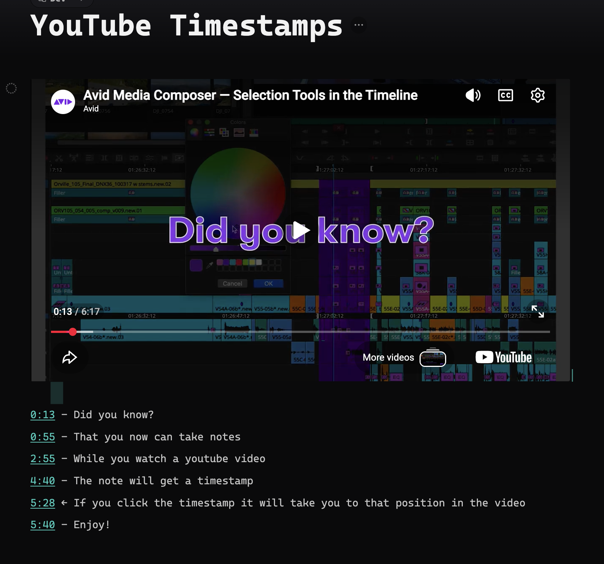

# YouTube Timestamps

YouTube Timestamps is a [Thymer](https://thymer.com) plugin for taking time-coded notes while watching an embedded YouTube video. Press a hotkey and a new note row stamped with the current playback position — `1:13 - ` — appears at your caret, ready to type into. Click any timestamp later and the embedded player jumps straight to that moment and resumes playing. Underneath, each timestamp is an ordinary YouTube link, so your notes stay useful everywhere: without the plugin (or the player) they simply open the video on YouTube at the right second.

```
0:42 - intro ends, agenda starts
2:13 - the three-act structure explained
5:01 - great example, come back to this
```



## How to use

1. Embed a YouTube video on a page (paste a YouTube link and turn it into a player widget).
2. Play the video. When something is worth noting, press **⌘⇧T** (macOS) or **Ctrl+Shift+T** (Windows/Linux).
3. A row `1:13 - ` appears at your caret with the cursor placed right after it. Just keep typing — even characters typed in the same instant as the hotkey land correctly.
4. When the next thought comes, press the hotkey again — each press starts the next timestamped row. No Enter needed between notes.
5. **Click** a timestamp to jump the player to that moment. **⌘+click** (Ctrl+click) opens the link on YouTube in your browser instead.

### Keep the video in view while you scroll

Run **"YouTube: Pin video while scrolling"** from the command palette (`Cmd/Ctrl+P`) to pin the player to the top of the panel, so it stays put as you scroll down through your notes. Run the command again to unpin it. The setting is remembered, and it's off by default so the video sits in the normal flow until you ask for it.

Good to know:

- Timestamps read the player's position, so a stamp reads `0:00` until the video has started playing at least once.
- With several videos on one page, a stamp uses the nearest player above your caret.
- If your caret is on an empty row when you stamp, the note takes its place — no stray blank lines between notes.
- After you click inside the video, keyboard focus belongs to YouTube and hotkeys would normally go dead. The plugin hands focus back to Thymer as soon as your mouse leaves the player, so the hotkey just keeps working.

## Installation

1. In Thymer, open the Command Palette (`Cmd+P` / `Ctrl+P`), run **Plugins**, and click **Create Plugin** under Global Plugins.
2. In the plugin's dialog, go to the code editor (click **Edit as Code** if you see the settings view).
3. In the **Custom Code** tab, replace the contents with [`plugin.js`](plugin.js).
4. In the **Configuration** tab, replace the contents with [`plugin.json`](plugin.json).
5. In the **Custom CSS** tab, paste [`plugin.css`](plugin.css) — optional but recommended, see below.
6. Click **Save**.

Don't enable Hot Reload (it's a development feature and can leave the plugin in a state where saved configuration stops persisting).

### Customizing

**Player size.** Thymer's default YouTube embed is small for watching while taking notes, so [`plugin.css`](plugin.css) widens it to 800px in 16:9. Want a different size? Edit the `width` value in the Custom CSS tab — for example `960px` or `100%` (`max-width: 100%` is already set, so a generous width is safe on narrow windows). Prefer Thymer's default size? Skip the CSS entirely; the plugin works the same without it.

**Hotkey.** Edit `HOTKEY_CODE` near the top of `plugin.js` (it takes a [KeyboardEvent code](https://developer.mozilla.org/en-US/docs/Web/API/UI_Events/Keyboard_event_code_values) like `KeyT`); the modifier combination is Cmd/Ctrl+Shift.

## How it works

- Thymer embeds YouTube as a plain iframe. The plugin reloads each embed once with `enablejsapi=1`, which lets it talk to the player through the [IFrame Player API](https://developers.google.com/youtube/iframe_api_reference) over `postMessage`: it listens for the player's position updates continuously and sends `seekTo` when you click a timestamp. The patch is applied the moment an embed appears, before you press play, so you never notice the reload.
- A stamp is written as one fresh row through the plugin SDK — never into the row you're editing, which makes it immune to the editor's commit timing. Your caret is handed to the new row as soon as it renders (typically ~100 ms); anything you type in that window is captured by the plugin and placed correctly.
- Each timestamp is a normal link segment pointing at `https://www.youtube.com/watch?v=…&t=42s`, which is why notes degrade gracefully into plain deep links wherever the plugin isn't running. (A small `yt-ts` query parameter is appended for internal bookkeeping; YouTube ignores it.)

## License

[MIT](LICENSE)
